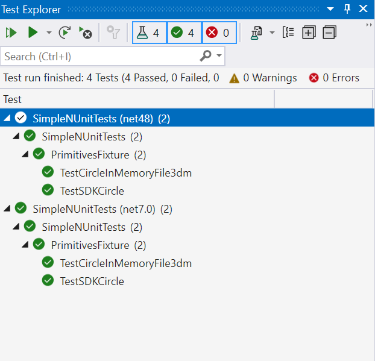
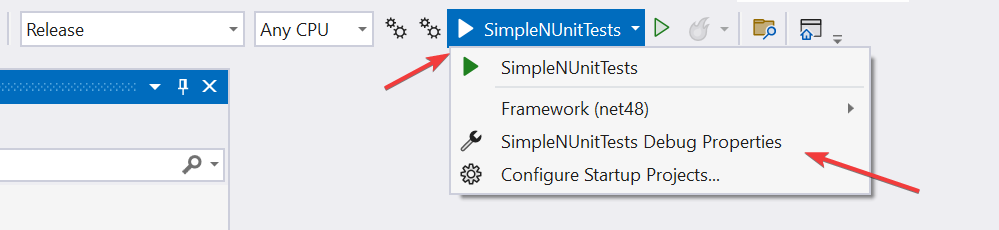
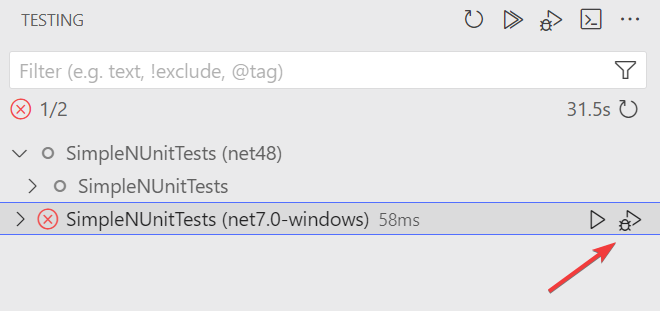
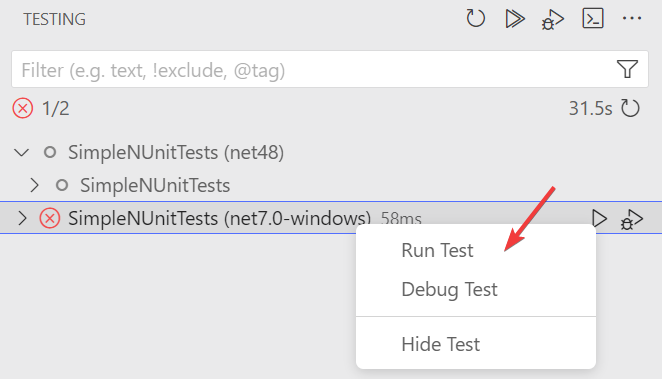
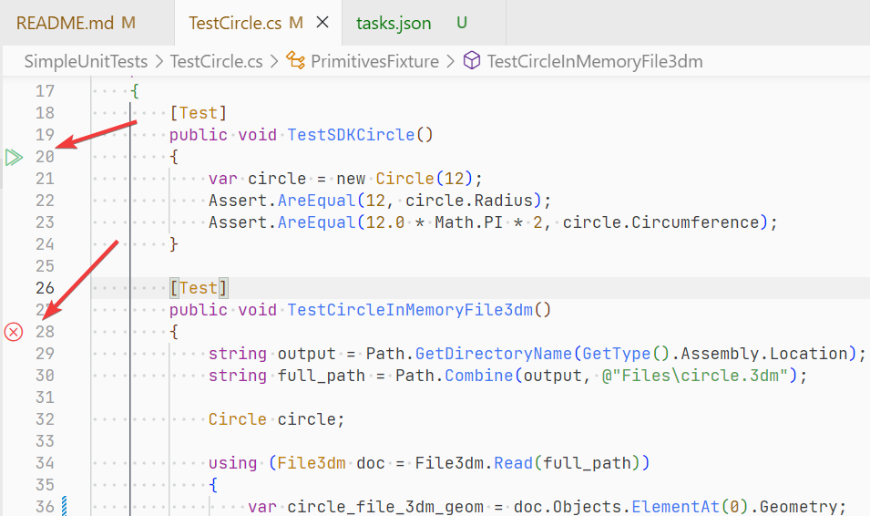
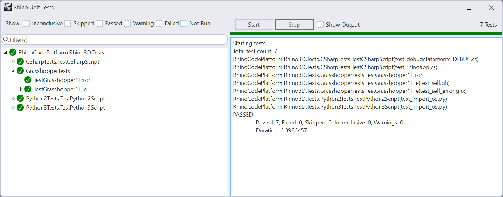

# SimpleRhinoTests

Example project to setup unit tests in Rhino >=8 using [Rhino.Testing](https://www.nuget.org/packages/Rhino.Testing) library.

## Settin Up Your Project

See  [Rhino.Testing README](https://github.com/mcneel/Rhino.Testing/blob/main/README.md) on how to setup your project.

### Referencing RhinoCommon

If you need to use RhinoCommon (other other Rhino assemblies) in your project, reference them based on the target framework, and **make sure they are NOT copied to the build directory** as they are shipped with Rhino:

```xml
  <PropertyGroup>
    <RhinoSystemDirectory>C:\Program Files\Rhino 8\System</RhinoSystemDirectory>
  </PropertyGroup>

  <ItemGroup Condition=" $(TargetFramework.Contains('net7.0')) == 'true'">
    <Reference Include="$(RhinoSystemDirectory)\netcore\RhinoCommon.dll" Private="False" />
  </ItemGroup>

  <ItemGroup Condition=" $(TargetFramework.Contains('net48')) == 'true'">
    <Reference Include="$(RhinoSystemDirectory)\RhinoCommon.dll" Private="False" />
  </ItemGroup>
```

## Local Testing

### From Visual Studio

- Open `SimpleNUnitTests.sln` in Visual Studio
- Open **Test Explorer** panel (From Tools -> Test Explorer menu)
- Build project
- **Test Explorer** panel will populate with tests for all frameworks the project is being built for.
- Right-Click on any branch of the test tree to **Run** or **Debug** tests in that branch.



- You can access the test configurations from the main toolbar as shown below:



- If native debugging is needed, activate option shown below:


### From VSCode

- Open this directory in vscode
- Make sure [C# Dev Kit](https://marketplace.visualstudio.com/items?itemName=ms-dotnettools.csdevkit) extension is installed
- Make sure **Testing** panel is active on the left activity bar
- Testing panel will populate with tests for all frameworks the project is being built for.
- Click **Run** or **Debug**button on any branch of the test tree or Right-Click to run or debug tests in that branch





- You can also click on the test button in the editor gutter to run individual tests from the source. This will run the selected test, in all the target frameworks:




### From Rhino (Work in Progress)

- Ensure RhinoNUnit plugin is loaded
- Run `NUnit` command
- Provide the path of compiled assembly that contains the tests. In this example it would be:
  - `SimpleNUnitTests/bin/Debug/net48/SimpleNUnitTests.dll` for Rhino running in dotnet framework (`net48`)
  - `SimpleNUnitTests/bin/Debug/net7.0-windows/SimpleNUnitTests.dll` for Rhino running in dotnet framework (`net7.0-windows`)
- A window like below will pop up. Click **Start** to run the tests:



### From shell

- Open Powershell
- Change directory to this project (`cd /path/to/SimpleNUnitTests/`)
- Run the command below to run tests for both `net48` and `net7.0-windows`. Use `-c` flag to specify a configuration:

```shell
dotnet test ./SimpleNUnitTests.sln -c Release
```

- Use `-f` flag to specify a framework (`net48` and `net7.0-windows`):

```shell
dotnet test ./SimpleNUnitTests.sln -f net48
```
## Automated Testing

### Using Github Actions (Work in Progress)

An example github workflow is setup under `.github/workflows/main.yml` that triggers running tests on every push to this repository.

## Contribute:

[Rhino.Testing](https://www.nuget.org/packages/Rhino.Testing) source repository is here: https://github.com/mcneel/Rhino.Testing

Feel free to fork, improve, and submit pull requests.